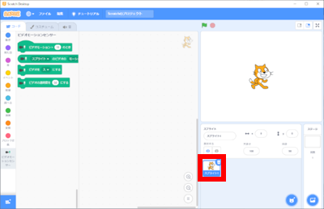

# 1. はじめに(Introduction)

このドキュメントでは、[Scratch 3.0](https://scratch.mit.edu/download)でビデオモーションセンサーを使ったゲームの作成方法を説明します。

This document explains how to develop games using video sensing in [Scratch 3.0](https://scratch.mit.edu/download).

ドキュメント作成者：脇本 一彌

Document Author：Kazuya Wakimoto

# 2. 準備(Preparation)

## 2-1. 準備①:開発環境(Preparation①:Development environment)

- [Scratch公式サイト(https://scratch.mit.edu/download)](https://scratch.mit.edu/download)から、Scratch 3.0をダウンロード、インストールする。(Scratch 3.0は、Windows、macOS、chromeOS、Androidに対応。(2020/05/06時点))

  Download and install Scratch 3.0 from the [Scratch official website(https://scratch.mit.edu/download)](https://scratch.mit.edu/download).(Scratch 3.0 is compatible with Windows, macOS, chromeOS, Android. (As of 2020/05/06))

- 開発で使うパソコン等に、カメラがついていることを確認してください。

  Confirm that the camera is attached to the personal computer or other device used for development. 

- カメラが使用可能であることを確認してください。

  Confirm the camera is ready for use.

## 2-2.準備②：拡張機能(Preparation②:Plugin)

- Scratch 3.0を起動後、 をクリックしてください。

  After launching Scratch 3.0, click on .

- **『ビデオモーションセンサー』を追加** してください。

  Add a "Video Motion Sensor".

- ビデオモーションセンサーが追加されていることを確認してください。

  Confirm you have added a video motion sensor.

# 3. 作り方(How to develop)

## 3-1.作る前の準備(Preparation before developing)

- Scratch 3.0を起動し、スプライト1を削除してください。(スプライト1を選択→×をクリック)

  Start Scratch 3.0 and delete sprite 1.(Select sprite 1　→　Click ×)

- をクリックしてください。

  Click on thebutton.

- Baloon1を選択、クリックしてください。

  Select a Baloon1 and click on it.

- スプライトが設定されていることを確認してください。

  Confirm that the selected sprite is set.

- 大きさを **『90』** に変更してください。(数字をダブルクリックすることで、数字を編集できる状態になります。)

  change the size to "70".(Double-clicking on a number, you will be able to edit the number.)

  

## 3-2. プログラムの作り方(How to develop a program)

### 3-2-1.完成イメージ(Completed image)

### 3-2-2. 詳細(Details)

- を押してください。

  Press .

- を押してください。
  Press.

- 以下の画面が表示されるので、 **『変数名』を『とくてん』に変更** してください。

  When the following screen is displayed, change the "Variable Name" to "Score" and press the OK button.

- 同じ手順で、**『たかさ』、『はば』**を作ってください。
  
  In the same way to make "Height" and "Width"

- **『とくてん』、『たかさ』、『はば』**を作ったら**とくてんのみ**にチェックをしてください。

  Check only "Score"
  
  

- 以下のブロックを画面中央にドラック＆ドロップします。

  Drag and drop the following blocks to the center of the screen.

 

 

 

 

- 以下のブロックを**3つ**画面中央にドラック＆ドロップします。

  Drag and drop the following three blocks to the center of the screen.

 

- の**左の数字を0、右の数字を94**に変更します。(数字をダブルクリックすることで、数字を編集できる状態になります。)

  Change the number on the left to 0 and the number on the right to 94.(Double-clicking on a number, you will be able to edit the number.)

- の▼ボタンを押し、表示される変数の一覧から **『とくてん』** を選んでください。

  Press the ▼ button on  and select "Score" from the list of variables displayed.

- の▼ボタンを押し、表示される変数の一覧から **『はば』** を選んでください。

  Press the ▼ button on  and select "Width" from the list of variables displayed.

- ブロックをくっつけてください。

  Connect the blocks.

- 以下のブロックを画面中央にドラック＆ドロップします。

  Drag and drop the following blocks to the center of the screen.

 

 

 

 

 

- の数字を**-3に変更**します。(数字をダブルクリックすることで、数字を編集できる状態になります。)

  Change the numberto -3.(Double-clicking on a number, you will be able to edit the number.)

- の**10**にをドラッグ&ドロップしてください。

  Drag and drop the into "10" in 

- ブロックをくっつけてください。

  Connect the blocks.

- 以下のブロックを画面中央にドラック＆ドロップします。

  Drag and drop the following blocks to the center of the screen.

  

 

  

   

  

  

- の6角形の空いているところにをドラッグ＆ドロップしてください。

  Drag and drop the into blanks in 

- の左の空いているところを**30に変更**し、右にをドラッグ&ドロップします。(空いているところをクリックすることで、数字を編集できる状態になります。)

  Change the left blanks to "30", and drag and drop the  into right in 

- の▼ボタンを押し、表示される変数の一覧から **『とくてん』** を選んでください。

  Press the ▼ button on  and select "Score" from the list of variables displayed.

- の数字を**20に変更**します。(数字をダブルクリックすることで、数字を編集できる状態になります。)

  Change the numberto 20.(Double-clicking on a number, you will be able to edit the number.)

- ブロックをくっつけてください。

  Connect the blocks.

- 以下のブロックを画面中央にドラック＆ドロップします。

  Drag and drop the following blocks to the center of the screen.

  

 

   

  

  

  

- の6角形の空いているところにをドラッグ＆ドロップしてください。

  Drag and drop the into blanks in

- の左の空いているところにをドラッグ&ドロップし、右の数字を**0に変更**します。(数字をダブルクリックすることで、数字を編集できる状態になります。)

  Drag and drop the  into the left blanks, and change the right number to 0. 

- の**10**にをドラッグ&ドロップしてください。

  Drag and drop the  into "10" in 

- の数字を**-1に変更**します。(数字をダブルクリックすることで、数字を編集できる状態になります。)

  Change the number to -1.(Double-clicking on a number, you will be able to edit the number.)

- ブロックをくっつけてください。

  Connect the blocks.

- 以下のブロックを画面中央にドラック＆ドロップします。

  Drag and drop the following blocks to the center of the screen.

  

 

  

  

   

- の6角形の空いているところにをドラッグ＆ドロップしてください。
  Drag and drop the into blanks in 

-  の左の空いているところにをドラッグ&ドロップし、右の数字を**-140に変更**します。(数字をダブルクリックすることで、数字を編集できる状態になります。)

  Drag and drop the  into the left blanks, and change the right number to -140. 

- ブロックをくっつけてください。

  Connect the blocks.

- 以下のブロックを画面中央にドラック＆ドロップします。

  Drag and drop the following blocks to the center of the screen.

 

 

 

 

 

  

  

  

  

- の**『10』**にをドラッグ＆ドロップしてください。

  Drag and drop the  into "10" in 

- の**左の数字を50、右の数字を100**に変更します。(数字をダブルクリックすることで、数字を編集できる状態になります。)

  Change the left number to 50, right number to 100.(Double-clicking on a number, you will be able to edit the number.)

- の▼ボタンを押し、表示される変数の一覧から **『はば』** を選んでください。

  Press the ▼ button on  and select "Width" from the list of variables displayed.

- の**『0』**にをドラッグ＆ドロップしてください。

  Drag and drop the  into "0" in 

- の**左の数字を-5、右の数字を0**に変更します。(数字をダブルクリックすることで、数字を編集できる状態になります。)

  Change the left number to -5, right number to 0.(Double-clicking on a number, you will be able to edit the number.)

- の**『10』**にをドラッグ＆ドロップしてください。

  Drag and drop the  into "10" in 
  
  

- ブロックをくっつけてください。

  Connect the blocks.

- 以下のブロックを画面中央にドラック＆ドロップします。

  Drag and drop the following blocks to the center of the screen.

 

 

 

  

  

  

  

- の**『10』**にをドラッグ＆ドロップしてください。

  Drag and drop the  into "10" in 

- の**左の数字を50、右の数字を100**に変更します。(数字をダブルクリックすることで、数字を編集できる状態になります。)

  Change the left number to 50, right number to 100.(Double-clicking on a number, you will be able to edit the number.)

- の▼ボタンを押し、表示される変数の一覧から **『はば』** を選んでください。
  Press the ▼ button on  and select "Width" from the list of variables displayed.

- の**『0』**にをドラッグ＆ドロップしてください。

  Drag and drop the  into "0" in 

- の**左の数字を0、右の数字を5**に変更します。(数字をダブルクリックすることで、数字を編集できる状態になります。)

  Change the left number to 0, right number to 5.(Double-clicking on a number, you will be able to edit the number.)

- の**『10』**にをドラッグ＆ドロップしてください。

  

- ブロックをくっつけてください。

  Connect the blocks.

# 4. 音の変更方法(How to change the sound)

- 『音』をクリックしてください。

  Click on the ”Sound” tab.

- をクリックしてください。

  Click on thebutton.

- 『A Bass』をクリックしてください。

  Click on the "A Bass" tile.

- 『コード』をクリックしてください。

  Click on the "Code" tab.

- 以下のブロックを画面中央にドラック＆ドロップします。

  Drag and drop the following blocks to the center of the screen.

  

- の▼ボタンを押し、表示される一覧から **『A Bass』** を選んでください。

  Press the ▼ button on  and select "A Bass" from the list displayed.

# 5. プログラムの保存方法(How to save the program)

Scrachのファイルのメニューから『コンピューターに保存する』を選択し、実行してください。

From the Scrach file menu, select "Save to computer" and run it.

# 6. プログラムの実行・停止方法(How to run and stop the program)

## 6-1. プログラムを実行(Run the program)

旗のボタンを押してください。

Press the flag button.

## 6-2. プログラムを停止(Stop the program)

赤いボタンを押してください。

Press the red button.

